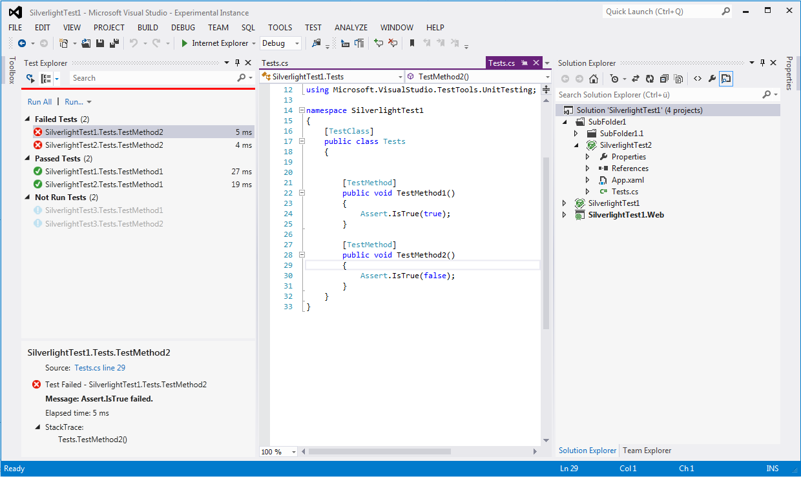

# Silverlight Unit Test Adapter

Test adapter for Visual Studio 2015 to integrate Silverlight 5 Unit Tests, based on the Silverlight Unit Test project type from the Silverlight Toolkit, available using the native Test Explorer in Visual Studio 2015

## Special Thanks

Niels Hebling [niels.hebling](https://nielshebling.de) for [Silverlight Unit Test Adapter for Visual Studio 2012](https://marketplace.visualstudio.com/items?itemName=nielshebling.SilverlightUnitTestAdapter)

Jason Jarrett [@staxmanade](https://github.com/staxmanade) for [Silverlight Testing Automation Tool (StatLight)](https://github.com/staxmanade/StatLight)