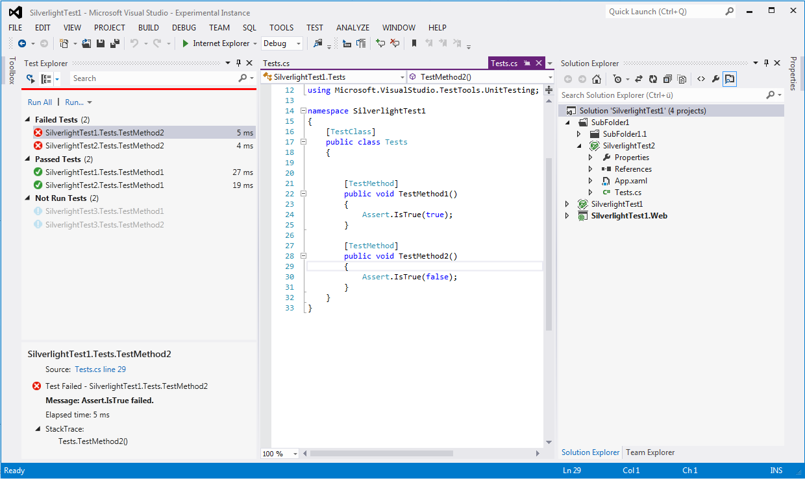

#  Silverlight Unit Test Adapter

Visual Studio 2015 Unit Test adapter for Silverlight 5

[](https://ci.appveyor.com/project/icnocop/silverlightunittestadapter/branch/master)

[Download this extension from the Visual Studio Marketplace](https://marketplace.visualstudio.com/items?itemName=RamiAbughazaleh.SilverlightUnitTestAdapter)



## Installation

The Visual Studio extension requires elevation during install and will be installed for all users in the a sub folder in Visual Studio's extension directory.

For example, "C:\Program Files (x86)\Microsoft Visual Studio 14.0\Common7\IDE\Extensions\\{8.3}", where "{8.3}" is an arbitrary directory.

## Configuration

The Silverlight unit test adapter reads configuration settings from `SilverlightUnitTestAdapter.json`.
This file must be placed in the same path as the test assembly.

### QueryString

Name-value pairs specified in the `QueryString` property can be retrieved using the `HtmlPage.Document.QueryString` property in the test assembly.
This allows you to pass arbitrary information to the assembly and methods under test.

```
{
  "QueryString": {
    "name1": "value1",
    "name2": "value2"
  }
  ...
}
```

### Plugins

The Silverlight unit test adapter can be extended by using plugins.
Plugins can be used to manipulate the test results as a way to work-around some of the limitations when running unit tests in Silverlight.
Paths can be specified relative to the test assembly.

```
{
  "Plugins": [
    "..\\..\\plugin1.dll",
    "..\\..\\plugin2.dll"
  ]
  ...
}
```

#### Creating a plugin

1. Create a new .NET 3.5+ Class Library project.
2. Install the `SilverlightUnitTestAdapter.Plugin` NuGet package.
3. Create the class that defines the plugin using the `IPlugin` interface.

```
using SilverlightUnitTestAdapter.Plugin;
using Microsoft.VisualStudio.TestPlatform.ObjectModel;

public class Plugin : IPlugin
{
    public void TransformTestResult(ILogger logger, TestResult testResult)
    {
        // get test assembly file path
        string testAssemblyFilePath = testResult.TestCase.Source;

        // get the test name
        string testName = result.TestCase.FullyQualifiedName;

        // get/set the test outcome (Passed, Failed, Skipped, etc.)
        Microsoft.VisualStudio.TestPlatform.ObjectModel.TestOutcome testOutcome = testResult.Outcome;

        // get/set the error message
        string errorMessage = testResult.ErrorMessage;

        // get/set the error stack trace
        string errorStackTrace = testResult.ErrorStackTrace;

        // add/remove attachments
        AttachmentSet attachmentSet = new AttachmentSet(new Uri("attachment://dummy"), "attachment");
        Uri testFile = new Uri(@"C:\file.txt", UriKind.Absolute);
        attachmentSet.Attachments.Add(new UriDataAttachment(testFile, "file.txt"));
        testResult.Attachments.Add(attachmentSet);

        // write messages to the test Output in the "Standard Output" category
        result.Messages.Add(new TestResultMessage(TestResultMessage.StandardOutCategory, "Standard Out"));

        // write messages to the test Output in the "Standard Error" category
        result.Messages.Add(new TestResultMessage(TestResultMessage.StandardErrorCategory, "Standard Error"));
    }
}

```
5. Add the path to the plugin dll in `SilverlightUnitTestAdapter.json`.

### Displaying exception stack traces with line numbers

1. Catch the exception in the unit test and generate an exception report using [ProductionStackTrace](https://github.com/gimelfarb/ProductionStackTrace/pull/13).
2. Re-throw a new exception that contains the exception report in the new exception's stacktrace.
3. Create a plugin that uses [ProductionStackTrace](https://github.com/gimelfarb/ProductionStackTrace) to translate the stacktrace in the `ErrorStackTrace` property of the `TestResult` parameter.

## Limitations

- Test methods can't run with elevated permissions
- Test methods are not run as fully trust
- Test methods are run as partially trusted
- No debugging support
- No test cancellation support

## Troubleshooting

Detailed messages are written in the Output window's "Silverlight Unit Test Adapter" pane.

## Credits

[Niels Hebling](https://nielshebling.de) for [Silverlight Unit Test Adapter for Visual Studio 2012](https://marketplace.visualstudio.com/items?itemName=nielshebling.SilverlightUnitTestAdapter)

[Jason Jarrett](https://github.com/staxmanade) and contributors for [Silverlight Testing Automation Tool (StatLight)](https://github.com/staxmanade/StatLight)

[PSDgraphics](http://www.psdgraphics.com/) for blue box icon

The Visual Studio logo is a trademark of Microsoft Corporation.
